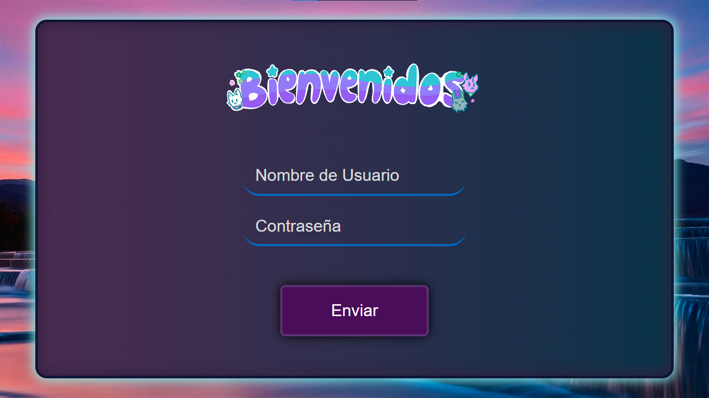
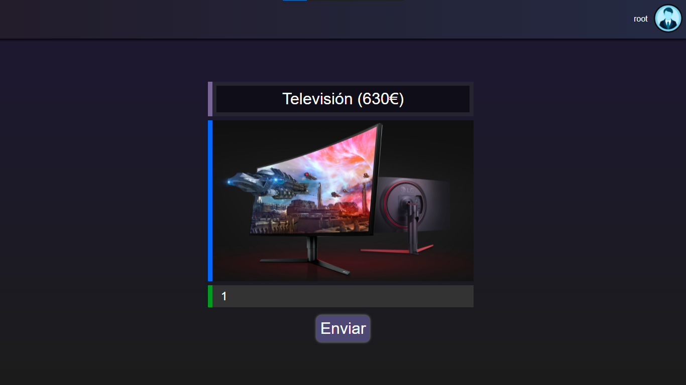
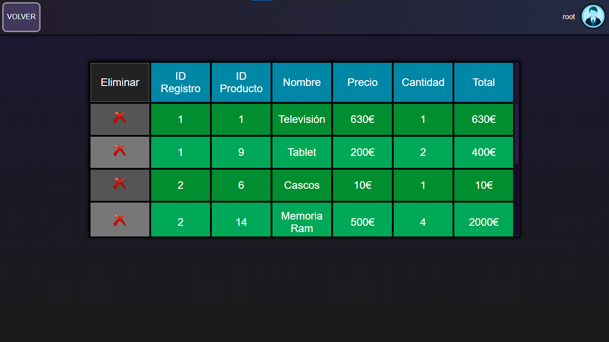

# Tienda Informática
CRUD para la asignatura de programación hecha con JSP

En está aplicación podrás ir seleccionando productos a tu gusto de los listados,
 mientras se van agregando al carrito.
 Una vez hayas decidido lo que quieres, le das al botón para terminar la compra
 y todos los productos que hayas comprado se guardarán en un registro al cual se
 te redireccionará y donde podrás consultar y eliminar los registros anteriores.

 
1. Página de Login y única página accesible mientras no se inicie la sesión.
 

 
Para iniciar sesión se hace usando el único usuario que se proporciona
 <strong>Usuario:</strong>    root
 <strong>Contraseña:</strong> root
  

 

 

 

 

